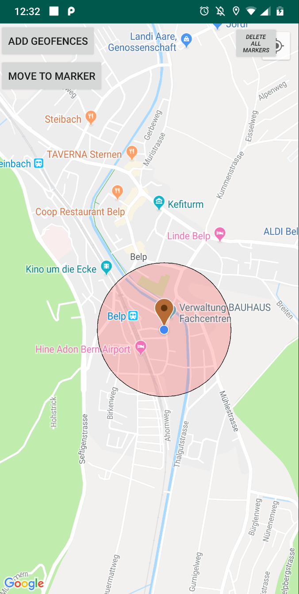
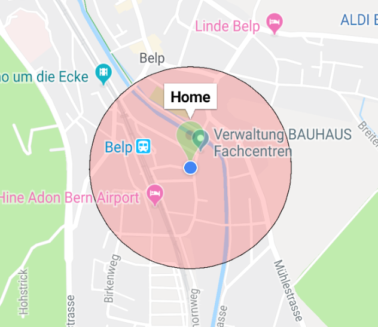
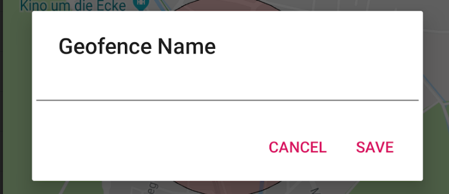

# GeofencingApp

This Android Application enables you to add geofences wherever you like. 
You can choose your current location or place it wherever you like on the map. 
The gelocations can be named and are shown on the map.

Entering or Exiting such a geofence triggers a notification and can trigger additional events.
Currently Geofences called "Home" and "Work" trigger events. 

Firstly when "home" is entered or exited, the Wland is enabled or disabled. Furthermore every Geofence trigger starts a post request to an Azure Function (API) where additional tasks could be added. All neccessary informations are sent to this api.

## Tracking

When the app is opened it tracks the users position and show it on the map, this helps to set new geofences, which can be done either by simply clicking on the map or by pressing the "go to marker" button which then sets a marker to the current location of the user. 

When adding a geofence a name has to be set which will be visible on the map. Furthermore the app blocks duplicated and overlapping geofences. 

## The App
The view with a single geofence:

The label of the geofence:

Adding the geofence:

